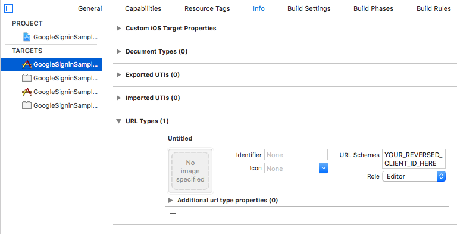

# rn-social-login

Apple, Google, Facebook Login in One SDK

## Installation

```sh
npm install rn-social-login react-native-fbsdk-next @invertase/react-native-apple-authentication @react-native-google-signin/google-signin
```

or

```sh
yarn add rn-social-login react-native-fbsdk-next @invertase/react-native-apple-authentication @react-native-google-signin/google-signin
```

## Pods Installation

```sh
cd ios && pod install && cd ..
```

## Prerequisites to using this library

### For Google Sign In Configuration

### For Android :

Download the configuration file (google-services.json) from Firebase into your project and add in android/app directory.

Update android/build.gradle with

```sh
buildscript {
    ext {
        buildToolsVersion = "a.b.c"
        minSdkVersion = x
        compileSdkVersion = y
        targetSdkVersion = z
        googlePlayServicesAuthVersion = "20.7.0" // <--- use this version or newer
    }
// ...
    dependencies {
        classpath 'com.google.gms:google-services:4.4.0' // <--- use this version or newer
    }
}
```

Update android/app/build.gradle with

```sh
apply plugin: "com.android.application"
apply plugin: "org.jetbrains.kotlin.android"
apply plugin: "com.facebook.react"
apply plugin: 'com.google.gms.google-services'
```

### For iOS :

Download the configuration file (GoogleService-Info.plist) from Firebase into your project and add in ios/<app_name> directory.

Xcode configuration:

Configure URL types in the Info panel (see screenshot)
add a URL with scheme set to your REVERSED_CLIENT_ID (found inside GoogleService-Info.plist or Google Cloud console)



### For Facebook Sign In Configuration

### For Android :

## Usage

## Contributing

See the [contributing guide](CONTRIBUTING.md) to learn how to contribute to the repository and the development workflow.

## License

MIT

---

Made with [create-react-native-library](https://github.com/callstack/react-native-builder-bob)
